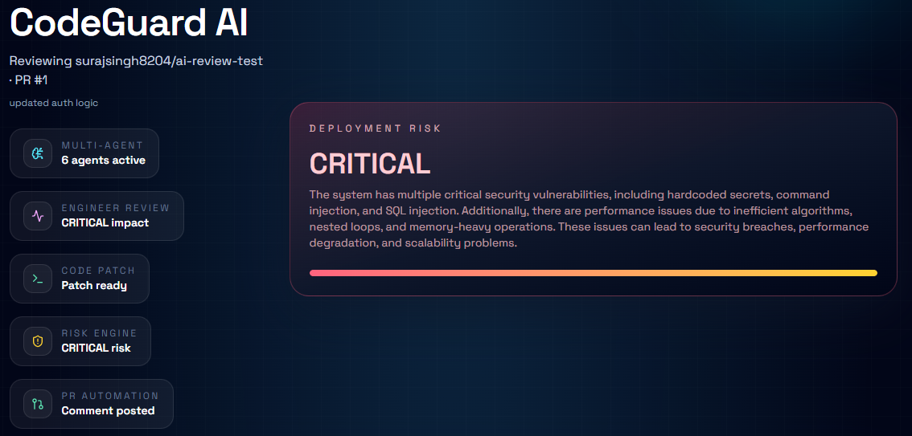
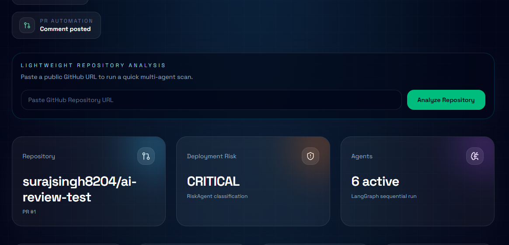
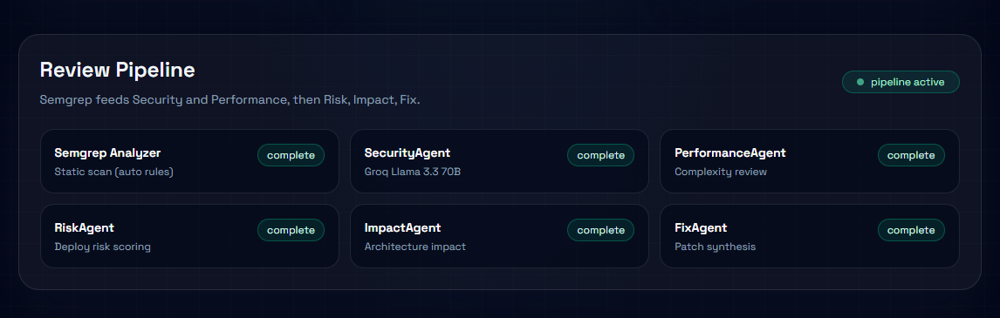
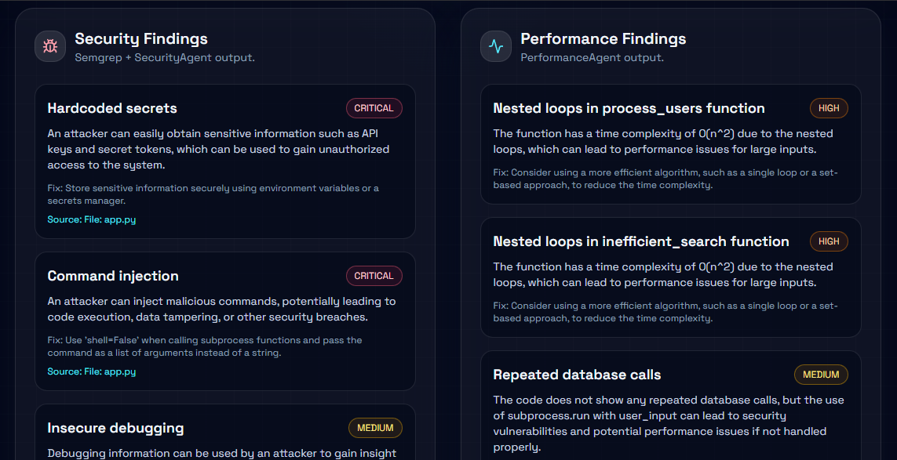
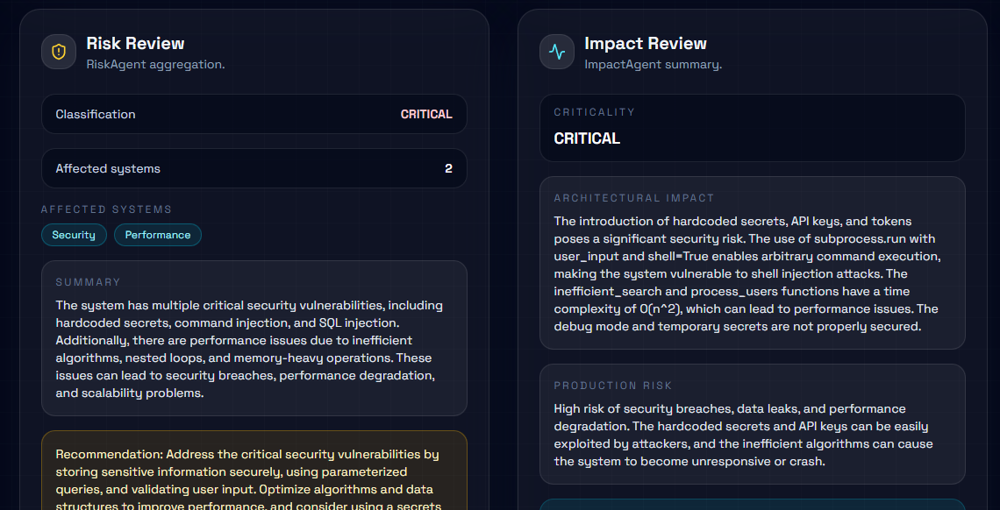
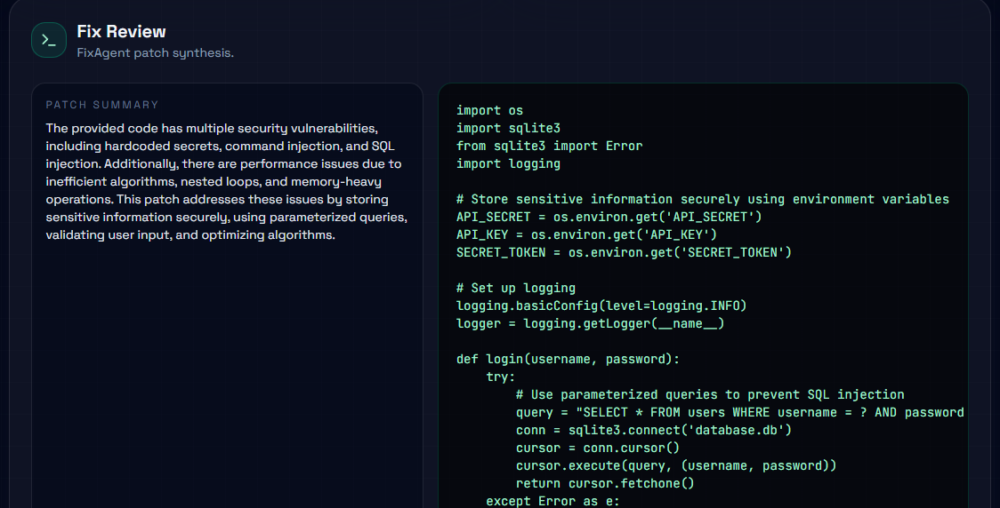

# CODEGUARD AI
## Autonomous Multi-Agent AI Senior Engineer for Pull Requests

---

# Overview

CODEGUARD AI is an autonomous multi-agent AI engineering platform designed to review pull requests like a senior software engineer.

The platform combines:

- Static Analysis
- Multi-Agent AI Reasoning
- Risk Intelligence
- Architectural Impact Analysis
- AI Patch Generation
- GitHub PR Automation
- LangGraph Orchestration

Unlike traditional code review bots, CODEGUARD AI does not merely identify issues.

It:

- Understands code risks
- Evaluates production impact
- Explains vulnerabilities
- Detects scalability problems
- Estimates deployment risk
- Generates secure patch suggestions
- Performs architectural reasoning

The platform acts as an autonomous AI engineering reviewer capable of supporting modern DevSecOps workflows.

---

# Frontend Demo (Vite)

The demo UI lives in frontend-vite and focuses on a single cinematic dashboard page for rapid judging.

Highlights:

- Risk status hero and live system indicators
- Multi-agent pipeline visualization
- Security findings and impact summary
- AI patch preview

Note: the dashboard currently uses mocked data until backend integration is completed.

---

# Live App

- https://codeguard-ai-rho.vercel.app

---

# Screenshots








---

# Webhook Demo (Option A: GitHub PR Webhook)

1. Fork the demo repo: https://github.com/surajsingh8204/ai-review-test
2. Create a new branch and make a small change (for example, add a comment in app.py).
3. Open a pull request back to the original repo.
4. Wait for the bot comment to appear on the PR.
5. Open the frontend dashboard and confirm the latest review appears.

---

# Repo URL Analysis (Option B: No Webhook)

The dashboard can analyze a public repository directly from its URL without GitHub webhooks.

1. Open the frontend dashboard.
2. Paste https://github.com/surajsingh8204/ai-review-test into the input.
3. Click Analyze Repository.
4. Review the findings in the dashboard.

---

# Core Vision

Traditional AI code reviewers:

```text
LLM → Generic Suggestions
```

CODEGUARD AI:

```text
Static Analysis
      ↓
Specialized AI Agents
      ↓
Risk Intelligence
      ↓
Architectural Understanding
      ↓
Patch Generation
      ↓
GitHub Engineering Review
```

---

# Key Capabilities

## Security Intelligence

Detects:

- SQL Injection
- Command Injection
- Hardcoded Secrets
- Unsafe File Access
- Authentication Flaws
- Dangerous APIs
- Insecure Patterns
- Shell Execution Vulnerabilities

Provides:

- Severity classification
- Business impact analysis
- Recommended fixes
- Production risk assessment

---

## Performance Intelligence

Detects:

- Nested loops
- Scalability bottlenecks
- Memory-heavy operations
- Redundant computations
- Inefficient algorithms
- Expensive operations
- Optimization opportunities

Provides:

- Complexity analysis
- Scalability implications
- Optimization guidance
- Refactoring recommendations

---

## Risk Intelligence

Calculates:

- Risk score
- Deployment risk
- Production danger level
- Affected systems
- Operational impact

Provides:

- Deployment recommendations
- Criticality estimation
- Executive-level summaries
- Risk prioritization

---

## Architectural Impact Analysis

Analyzes:

- System-wide impact
- Critical modules affected
- Architectural implications
- Shared system risks
- Production dependencies

Provides:

- Architectural reasoning
- Production stability assessment
- Criticality analysis
- System impact summaries

---

## AI Patch Generation

Generates:

- Secure code replacements
- Optimized implementations
- Safer patterns
- Clean code refactors
- Suggested patches

Capabilities:

- Security-focused rewrites
- Performance optimization
- Better engineering practices
- Safer subprocess execution
- Secure database access patterns

---

# System Architecture

## High-Level Architecture

```text
                    ┌──────────────────────┐
                    │    GitHub Webhook    │
                    └──────────┬───────────┘
                               │
                               ▼
                    ┌──────────────────────┐
                    │   PR Diff Extraction │
                    └──────────┬───────────┘
                               │
                               ▼
              ┌─────────────────────────────────┐
              │  Static Analysis Layer          │
              │                                 │
              │         Semgrep Engine          │
              └────────────────┬────────────────┘
                               │
                               ▼
              ┌─────────────────────────────────┐
              │ LangGraph Multi-Agent Workflow  │
              └────────────────┬────────────────┘
                               │
       ┌───────────────────────┼───────────────────────┐
       ▼                       ▼                       ▼
┌──────────────┐      ┌──────────────┐      ┌──────────────┐
│SecurityAgent │      │Performance   │      │ RiskAgent    │
│              │      │Agent         │      │              │
└──────┬───────┘      └──────┬───────┘      └──────┬───────┘
       │                     │                     │
       └─────────────────────┼─────────────────────┘
                             ▼
                  ┌──────────────────┐
                  │  ImpactAgent     │
                  └────────┬─────────┘
                           ▼
                  ┌──────────────────┐
                  │    FixAgent      │
                  └────────┬─────────┘
                           ▼
              ┌─────────────────────────────┐
              │ Unified Engineering Review  │
              └──────────────┬──────────────┘
                             ▼
                 ┌────────────────────────┐
                 │ GitHub PR AI Comment   │
                 └────────────────────────┘
```

---

# LangGraph Agent Orchestration

CODEGUARD AI uses LangGraph for deterministic multi-agent orchestration.

Instead of a single LLM call:

```text
Single AI Prompt
```

The system uses specialized engineering agents:

```text
SecurityAgent
      ↓
PerformanceAgent
      ↓
RiskAgent
      ↓
ImpactAgent
      ↓
FixAgent
```

Each agent:

- Performs specialized reasoning
- Receives structured state
- Enhances previous outputs
- Contributes domain expertise

This architecture creates:

- Stability
- Deterministic execution
- Better debugging
- Modular scaling
- Enterprise-style orchestration

---

# Agent Responsibilities

## 1. SecurityAgent

### Responsibilities

- Security vulnerability detection
- Vulnerability classification
- Severity estimation
- Security reasoning
- Attack surface analysis

### Integrations

- Semgrep
- Groq LLM

### Detects

- SQL injection
- Command injection
- Hardcoded secrets
- Authentication flaws
- Unsafe APIs
- Dangerous subprocess usage

### Output Example

```json
{
  "severity": "CRITICAL",
  "issue": "Command Injection",
  "impact": "Attackers may execute arbitrary system commands.",
  "fix": "Use subprocess.run with shell=False"
}
```

---

## 2. PerformanceAgent

### Responsibilities

- Scalability analysis
- Algorithm optimization
- Performance bottleneck detection
- Complexity estimation

### Detects

- Nested loops
- O(n²) complexity
- Memory-heavy operations
- Redundant computations
- Expensive logic

### Output Example

```json
{
  "severity": "HIGH",
  "issue": "Nested loops",
  "impact": "O(n²) time complexity",
  "fix": "Use set-based optimization"
}
```

---

## 3. RiskAgent

### Responsibilities

- Production risk estimation
- Deployment analysis
- Executive-level summarization
- Risk scoring

### Produces

- Risk score
- Deployment risk level
- Production danger estimation
- Criticality assessment

### Output Example

```json
{
  "risk_score": 85,
  "deployment_risk": "CRITICAL",
  "summary": "Deployment may expose severe security vulnerabilities"
}
```

---

## 4. ImpactAgent

### Responsibilities

- Architectural reasoning
- System impact analysis
- Critical module identification
- Production dependency estimation

### Produces

- Affected systems
- Architectural impact
- Production implications
- System-wide reasoning

### Output Example

```json
{
  "criticality": "CRITICAL",
  "affected_systems": [
    "Authentication",
    "API Gateway"
  ]
}
```

---

## 5. FixAgent

### Responsibilities

- AI patch generation
- Secure refactoring
- Optimized rewrites
- Engineering improvement suggestions

### Produces

- Suggested patches
- Safer implementations
- Optimized code
- Engineering explanations

### Example

```diff
- subprocess.run(user_input, shell=True)
+ subprocess.run(
+     ["python", "safe_script.py"],
+     shell=False
+ )
```

---

# Static Analysis Layer

## Semgrep Integration

CODEGUARD AI integrates Semgrep for deterministic vulnerability scanning.

### Why Hybrid Analysis Matters

Traditional LLM-only systems:

```text
AI Guessing
```

CODEGUARD AI:

```text
Deterministic Static Analysis
            +
AI Contextual Reasoning
```

This significantly improves:

- Reliability
- Precision
- Trustworthiness
- Enterprise readiness

---

# Engineering Workflow

## Pull Request Flow

```text
1. Developer opens PR
          ↓
2. GitHub webhook triggered
          ↓
3. Backend receives PR event
          ↓
4. PR diff extracted
          ↓
5. Semgrep static analysis executed
          ↓
6. LangGraph orchestration begins
          ↓
7. SecurityAgent analyzes vulnerabilities
          ↓
8. PerformanceAgent analyzes scalability
          ↓
9. RiskAgent estimates deployment danger
         ↓
10. ImpactAgent analyzes architecture impact
         ↓
11. FixAgent generates improved patch
         ↓
12. Unified engineering review generated
         ↓
13. GitHub PR comment automatically posted
```

---

# Repository Structure

```text
backend/
└── src/
      ├── agents/
      │   ├── base/
      │   ├── security/
      │   ├── performance/
      │   ├── risk/
      │   ├── impact/
      │   ├── fix/
      │   └── review/
      │
      ├── analyzers/
      │   └── static/
      │       └── semgrep_analyzer.py
      │
      ├── github_service/
      │   ├── clients/
      │   ├── services/
      │   └── webhook/
      │
      ├── core/
      │   ├── config/
      │   └── logger/
      │
      └── main.py

frontend-vite/
└── src/
      ├── App.jsx
      └── pages/
            └── Dashboard.jsx
```

---

# Technology Stack

## Backend

- FastAPI
- Python
- Uvicorn

## Frontend

- Vite
- React
- Tailwind CSS
- Lucide React

## AI Infrastructure

- Groq
- Llama 3.3 70B
- LangGraph

## Security & Static Analysis

- Semgrep

## Orchestration

- LangGraph StateGraph

## Integration

- GitHub Webhooks
- GitHub API

---

# Security Capabilities

CODEGUARD AI currently detects:

| Capability | Supported |
|---|---|
| SQL Injection | Yes |
| Command Injection | Yes |
| Hardcoded Secrets | Yes |
| Dangerous subprocess usage | Yes |
| Unsafe file access | Yes |
| Authentication flaws | Yes |
| Debug exposure | Yes |
| Scalability issues | Yes |
| Nested loop detection | Yes |
| Memory-heavy operations | Yes |

---

# Multi-Agent Reasoning Design

CODEGUARD AI uses deterministic sequential reasoning.

Why?

Because:

- Stable execution matters
- Debuggability matters
- Predictability matters
- Production systems require consistency

The architecture intentionally avoids chaotic autonomous loops.

Instead it uses:

```text
Structured State
        ↓
Specialized Agent
        ↓
State Enhancement
        ↓
Next Specialized Agent
```

This creates:

- modular intelligence
- scalable architecture
- reliable outputs
- maintainable systems

---

# Example AI Review Output

```text
🔐 Security Findings
- Command Injection
- SQL Injection
- Hardcoded Secrets

⚡ Performance Findings
- O(n²) nested loops
- Scalability issues

📊 Risk Analysis
- Risk Score: 85/100
- Deployment Risk: CRITICAL

🏗️ Architectural Impact
- Affects API Gateway
- Affects Database Layer

🛠️ Suggested AI Patch
- Safer subprocess implementation
- Parameterized SQL queries
```

---

# Build Phases

## Phase 1 — Core Infrastructure

- FastAPI setup
- GitHub webhook integration
- PR event capture
- GitHub API integration

---

## Phase 2 — Multi-Agent System

- SecurityAgent
- PerformanceAgent
- LangGraph orchestration
- Structured review system

---

## Phase 3 — Risk Intelligence

- RiskAgent
- Deployment risk analysis
- Risk scoring engine

---

## Phase 4 — Hybrid Security Layer

- Semgrep integration
- Static analysis engine
- Hybrid AI + deterministic reasoning

---

## Phase 5 — Architectural Intelligence

- ImpactAgent
- Architectural impact analysis
- System dependency reasoning

---

## Phase 6 — AI Patch Generation

- FixAgent
- Secure patch suggestions
- AI engineering improvements

---

# Future Enhancements

Potential future upgrades:

- Tree-sitter AST analysis
- Dependency graph intelligence
- ChromaDB repository memory
- RAG repository understanding
- Auto patch application
- GitHub check runs
- CI/CD integration
- Real-time dashboards
- Multi-repository intelligence
- Team-wide analytics
- Autonomous remediation pipelines

---

# Why CODEGUARD AI Is Different

Most AI code review tools:

```text
Single LLM Prompt
```

CODEGUARD AI:

```text
Static Analysis
      ↓
Specialized Multi-Agent Reasoning
      ↓
Risk Intelligence
      ↓
Architectural Understanding
      ↓
AI Patch Generation
```

This creates:

- Higher reliability
- Better engineering reasoning
- Production-aware analysis
- Enterprise-style intelligence

---

# Final Vision

CODEGUARD AI aims to become:

> An autonomous AI senior engineer capable of reviewing pull requests, understanding production risks, reasoning about architecture, and generating secure engineering improvements automatically.

---

# End-to-End Workflow Diagram

```text
┌──────────────────────────────────────────┐
│          Developer Opens PR              │
└────────────────────┬─────────────────────┘
                     │
                     ▼
┌──────────────────────────────────────────┐
│         GitHub Webhook Triggered         │
└────────────────────┬─────────────────────┘
                     │
                     ▼
┌──────────────────────────────────────────┐
│          FastAPI Backend Receives        │
└────────────────────┬─────────────────────┘
                     │
                     ▼
┌──────────────────────────────────────────┐
│            PR Diff Extraction            │
└────────────────────┬─────────────────────┘
                     │
                     ▼
┌──────────────────────────────────────────┐
│         Semgrep Static Analysis          │
└────────────────────┬─────────────────────┘
                     │
                     ▼
┌──────────────────────────────────────────┐
│       LangGraph Multi-Agent Engine       │
└────────────────────┬─────────────────────┘
                     │
      ┌──────────────┼──────────────┐
      ▼              ▼              ▼
┌──────────┐  ┌──────────────┐  ┌──────────┐
│Security  │  │ Performance  │  │  Risk    │
│ Agent    │  │ Agent        │  │ Agent    │
└────┬─────┘  └──────┬───────┘  └────┬─────┘
     │               │               │
     └───────────────┼───────────────┘
                     ▼
             ┌──────────────┐
             │ ImpactAgent  │
             └──────┬───────┘
                    ▼
             ┌──────────────┐
             │  FixAgent    │
             └──────┬───────┘
                    ▼
┌──────────────────────────────────────────┐
│      Unified Engineering Intelligence    │
└────────────────────┬─────────────────────┘
                     ▼
┌──────────────────────────────────────────┐
│         GitHub PR AI Review Comment      │
└──────────────────────────────────────────┘
```

---

# License

MIT License

---

# Author

Suraj Surajsingh8204@gmail.com

Built as a high-speed autonomous multi-agent AI engineering platform during an intensive hackathon development cycle.

